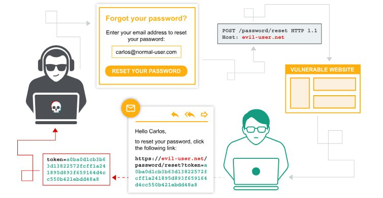

### Authentication vulnerabilities

  

#### Vulnerabilities in password-based login
--------------------------------------------------------------------------------------
No | Lab  | Difficulty | Status 
-------------------------------------|----------------------------|----------------------------|----------------------------
1 | Username enumeration via different responses | Apprentice | ✅ Completed
2 | Username enumeration via subtly different responses | Practitioner | ✅ Completed
3 | Username enumeration via response timing | Practitioner | ✅ Completed
4 | Broken brute-force protection, IP block | Practitioner | ✅ Completed
5 | Username enumeration via account lock | Practitioner | ✅ Completed
6 | Broken brute-force protection, multiple credentials per request | Expert | ✅ Completed

