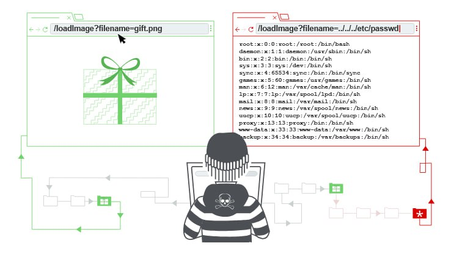

### Path traversal

  

--------------------------------------------------------------------------------------
No | Lab  | Difficulty | Status 
-------------------------------------|----------------------------|----------------------------|----------------------------
1 | File path traversal, simple case| Apprentice | ✅ Completed
2 | File path traversal, traversal sequences blocked with absolute path bypass | Practitioner | ✅ Completed
3 | File path traversal, traversal sequences stripped non-recursively | Practitioner | ✅ Completed
4 | File path traversal, traversal sequences stripped with superfluous URL-decode | Practitioner | ✅ Completed
5 | File path traversal, validation of start of path | Practitioner | ✅ Completed
6 | File path traversal, validation of file extension with null byte bypass | Practitioner | ✅ Completed
